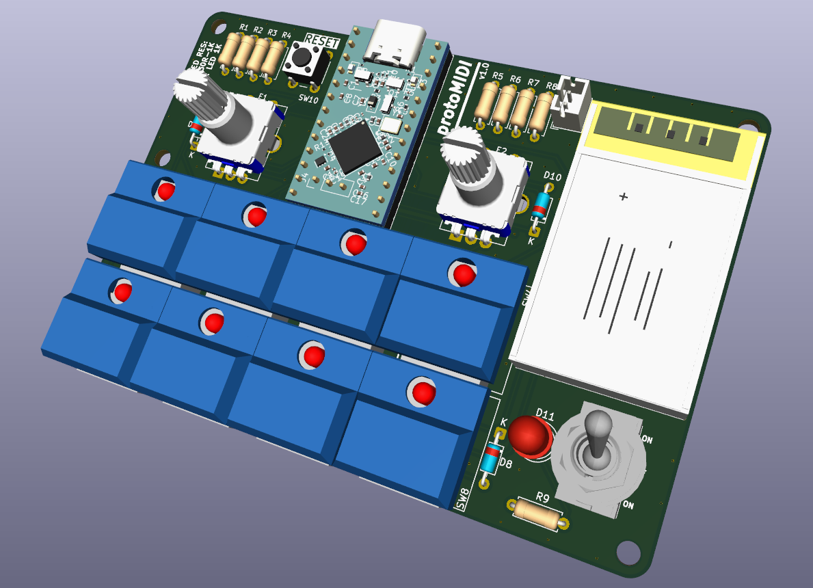
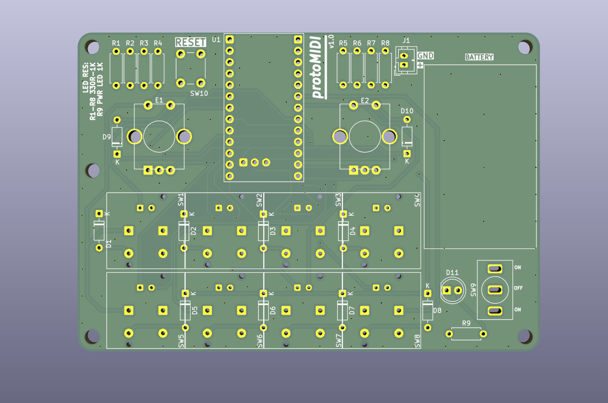
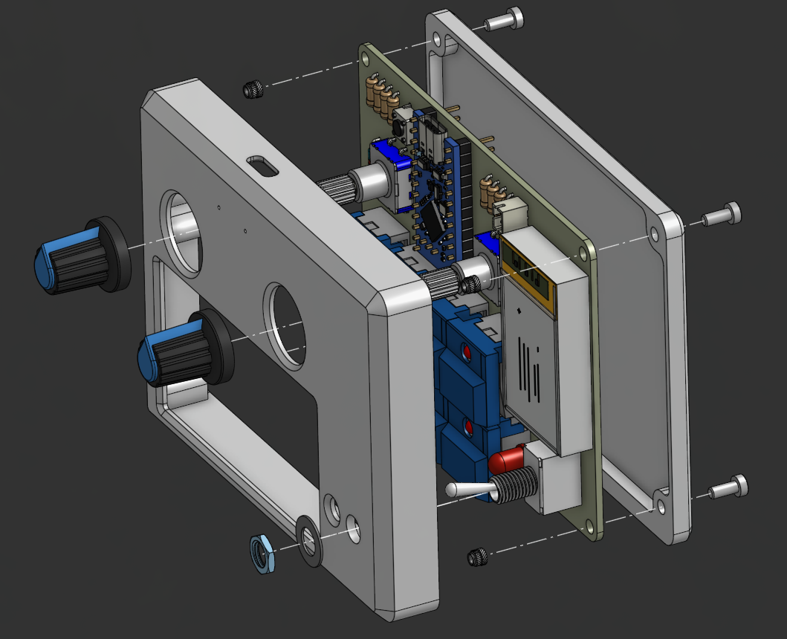
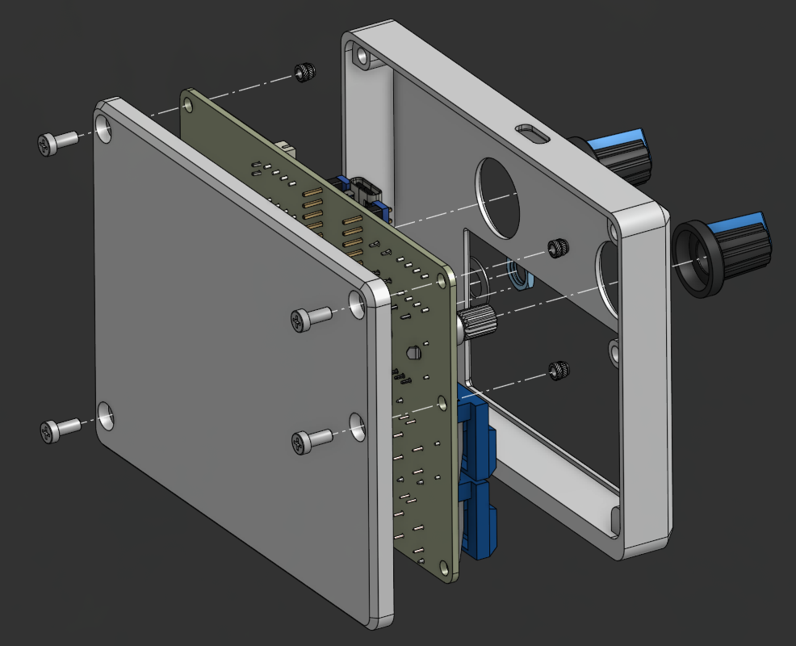
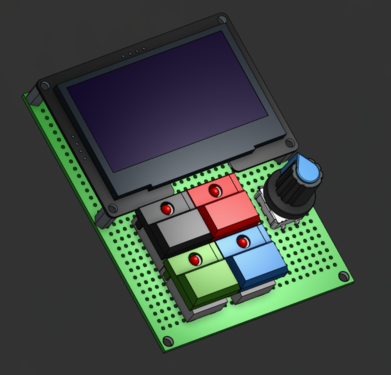
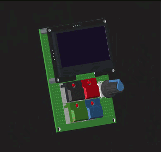

# protoMIDI Hardware

This directory documents the protoMIDI custom PCB and two-piece enclosure. v1.1
is the current release; the original v1.0 manufacturing handoff remains
available for reproducibility.

## Manufacturing Handoffs

| Version | Status | Contents |
| --- | --- | --- |
| [v1.1 DFM pack](./protoMIDI-DFM-PACK-v1.1/README.md) | Current | v1.1 PCB Gerbers/drills and revised enclosure STEP/STL exports |
| [v1.0 DFM pack](./protoMIDI-DFM-PACK-v1.0/README.md) | Historical | Original PCB Gerbers/drills, enclosure STEP/STL exports, and top drawing DXF |

The packs are deliberately versioned rather than replacing the earlier
manufacturing release.

## v1.1 Changes

- Refined PCB silkscreen and exported a new v1.1 Gerber set
- Increased enclosure wall thickness
- Increased clearance around the USB-C connector
- Increased switch clearance
- Added a slight angle to the bottom enclosure
- Promoted the ZMK Studio USB firmware to the supported v1.1 build

## Hardware Scope

- Custom PCB with nRF52840 Pro Micro style controller footprint
- 8x PB86-B1 illuminated push buttons
- 2x EC11/PEC11R style rotary encoders
- 2x encoder knobs, referenced in the local enclosure assembly CAD
- 1x MTS-style toggle switch
- 1x 6 mm utility push button
- 1x LiPo battery connector
- Two-piece enclosure: top and bottom
- M2.5 mounting hardware with threaded inserts, referenced by the local CAD

The OLED display is prototype-only and is not part of v1.0 or v1.1.

## BOM

The electronic BOM is common to v1.0 and v1.1. Mechanical items are added from
the enclosure/CAD design. Copies of this table live in both DFM pack READMEs.

`R1-R8` are the illuminated switch LED current-limit resistors. `R9` is the
power/status LED current-limit resistor for `D11`.

| Qty | References | Value / Part | Description |
| ---: | --- | --- | --- |
| 1 | BT1 | Battery_Cell | Single-cell LiPo battery, KiCad footprint `Battery_LiPo_802540_800mAh` |
| 10 | D1-D10 | 1N4148 | Signal diodes for switch matrix |
| 1 | D11 | LED | 5 mm power/status indicator LED |
| 2 | E1,E2 | PEC11R-4215F-S0024 | EC11/PEC11R style vertical rotary encoders, 15 mm shaft |
| 1 | J1 | JST PH 1x02 | 2-pin vertical battery connector, 2.00 mm pitch |
| 8 | R1-R8 | 330 ohm | Through-hole resistors for illuminated switch LEDs |
| 1 | R9 | 680 ohm to 1 kOhm | Through-hole resistor for power/status LED `D11` |
| 8 | SW1-SW8 | PB86-B1 | Illuminated momentary push buttons |
| 1 | SW9 | SW_DPDT_x2 / MTS style | Vertical toggle switch |
| 1 | SW10 | SW_Push | 6 x 6 mm utility push button |
| 1 | U1 | nRF ProMicro | nRF52840 Pro Micro style controller module |
| 2 | ENC knobs | ROTARY_ENCODER_KNOB | Encoder knobs; see the local versioned enclosure assembly in `hardware/CAD/` for fit/details |
| 1 | Enclosure top | protoMIDI ENCLOSURE TOP | STEP/STL export in the selected versioned DFM pack |
| 1 | Enclosure bottom | protoMIDI ENCLOSURE BOTTOM | STEP/STL export in the selected versioned DFM pack |
| 4 | Mounting screws | EDDT-M2.5-L6 | M2.5 L6 screw reference; local CAD file `hardware/CAD/EDDT-M2.5-L6.step` |
| 4 | Threaded inserts | EMLZ-M2.5-L3 | M2.5 L3 threaded insert reference; local CAD file `hardware/CAD/EMLZ-M2.5-L3.step` |

## Media

> **Asset version:** The following project images show v1.0. They have not yet
> been regenerated for the v1.1 enclosure and silkscreen updates.

## Source Boundary

The active KiCad source in `hardware/protoMIDI-KiCAD/` and CAD references in
`hardware/CAD/` are local working files and intentionally ignored. The tracked
public handoffs are the versioned DFM packs above.

## Prototype Reference

The Rev A prototype remains available for comparison:

- [Prototype overview](../prototype/README.md)
- [Prototype firmware](../prototype/firmware/README.md)
- [Prototype STEP assembly](../prototype/CAD/protoMIDI%20ASSEMBLY.step)

## Component References

Useful component notes remain in [resources](../resources/README.md). Some notes
are historical prototype references; the display page is not part of v1.0 or
v1.1.
