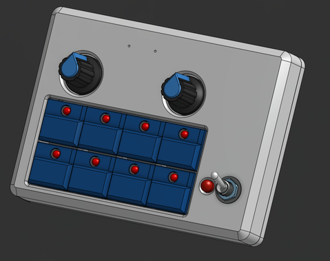
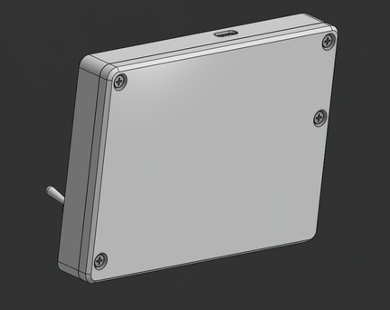

# protoMIDI v1.0 DFM Pack

This folder preserves the original v1.0 manufacturing handoff. Use the
[v1.1 DFM pack](../protoMIDI-DFM-PACK-v1.1/README.md) for the current release.

## Files

| Path | Contents |
| --- | --- |
| [PCB-GERBERS](./PCB-GERBERS/) | PCB copper, mask, paste, silkscreen, edge cuts, PTH drill, and NPTH drill files |
| [ENCLOSURE](./ENCLOSURE/) | Original enclosure top and bottom STEP/STL exports plus the top drawing DXF |

Enclosure exports:

- [protoMIDI ENCLOSURE TOP.step](./ENCLOSURE/protoMIDI%20ENCLOSURE%20TOP.step)
- [protoMIDI ENCLOSURE TOP.stl](./ENCLOSURE/protoMIDI%20ENCLOSURE%20TOP.stl)
- [protoMIDI ENCLOSURE TOP DRAWING.dxf](./ENCLOSURE/protoMIDI%20ENCLOSURE%20TOP%20DRAWING.dxf)
- [protoMIDI ENCLOSURE BOTTOM.step](./ENCLOSURE/protoMIDI%20ENCLOSURE%20BOTTOM.step)
- [protoMIDI ENCLOSURE BOTTOM.stl](./ENCLOSURE/protoMIDI%20ENCLOSURE%20BOTTOM.stl)

The KiCad source project and local CAD reference files remain ignored in
`hardware/protoMIDI-KiCAD/` and `hardware/CAD/`.

## BOM

| Qty | References | Value / Part | Description |
| ---: | --- | --- | --- |
| 1 | BT1 | Battery_Cell | Single-cell LiPo battery, KiCad footprint `Battery_LiPo_802540_800mAh` |
| 10 | D1-D10 | 1N4148 | Signal diodes for switch matrix |
| 1 | D11 | LED | 5 mm power/status indicator LED |
| 2 | E1,E2 | PEC11R-4215F-S0024 | EC11/PEC11R style vertical rotary encoders, 15 mm shaft |
| 1 | J1 | JST PH 1x02 | 2-pin vertical battery connector, 2.00 mm pitch |
| 8 | R1-R8 | 330 ohm | Through-hole resistors for illuminated switch LEDs |
| 1 | R9 | 680 ohm to 1 kOhm | Through-hole resistor for power/status LED `D11` |
| 8 | SW1-SW8 | PB86-B1 | Illuminated momentary push buttons |
| 1 | SW9 | SW_DPDT_x2 / MTS style | Vertical toggle switch |
| 1 | SW10 | SW_Push | 6 x 6 mm utility push button |
| 1 | U1 | nRF ProMicro | nRF52840 Pro Micro style controller module |
| 2 | ENC knobs | ROTARY_ENCODER_KNOB | Encoder knobs; see local CAD assembly for fit/details |
| 1 | Enclosure top | protoMIDI ENCLOSURE TOP | STEP/STL export in `ENCLOSURE/` |
| 1 | Enclosure bottom | protoMIDI ENCLOSURE BOTTOM | STEP/STL export in `ENCLOSURE/` |
| 4 | Mounting screws | EDDT-M2.5-L6 | M2.5 L6 screw reference |
| 4 | Threaded inserts | EMLZ-M2.5-L3 | M2.5 L3 threaded insert reference |

## Visual References

The project assets below are v1.0 and therefore match this DFM pack:

